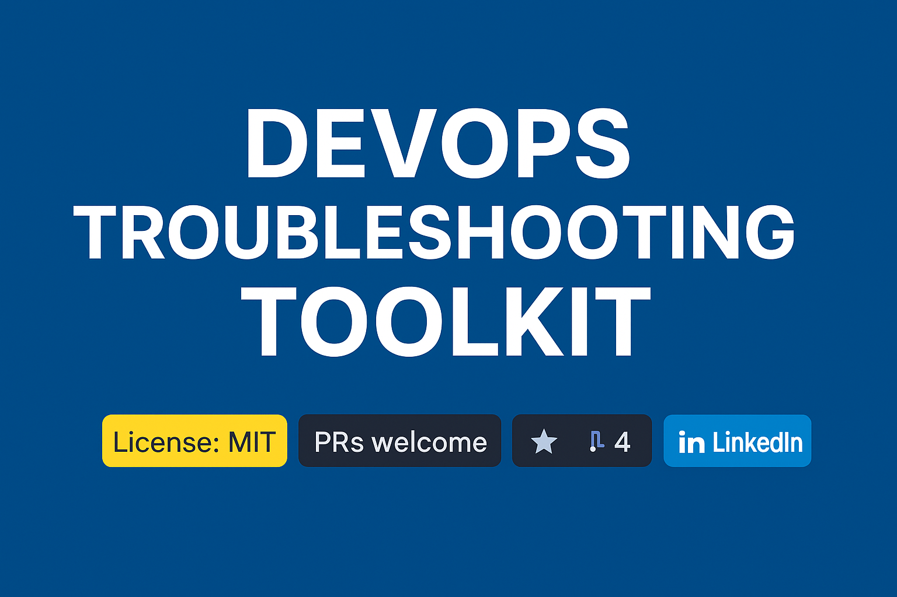

# DevOps Troubleshooting Toolkit

<div align="center">
  
  
  [](https://opensource.org/licenses/MIT)
  [](CONTRIBUTING.md)
  [](https://github.com/yourusername/devops-troubleshooting-toolkit/stargazers)
  [](https://github.com/yourusername/devops-troubleshooting-toolkit/network/members)
  [](https://twitter.com/yourtwitterhandle)
</div>

> A comprehensive collection of commands, tools, and methodologies for troubleshooting DevOps environments - from Linux to Kubernetes and beyond.

## 📖 Table of Contents

- [About This Project](#about-this-project)
- [Quick Reference Guides](#quick-reference-guides)
- [Common Issues](#common-issues)
- [Content Organization](#content-organization)
- [Installation and Usage](#installation-and-usage)
- [Contributing](#contributing)
- [License](#license)
- [Related Resources](#related-resources)

## 🔎 About This Project

The DevOps Troubleshooting Toolkit is designed to be the definitive resource for diagnosing and resolving issues across the entire DevOps stack. This repository provides structured, practical guidance for engineers working with modern infrastructure and applications.

### Why This Toolkit Exists

As systems grow more complex and distributed, troubleshooting becomes increasingly challenging. This toolkit aims to:

- Provide structured approaches to solving common (and uncommon) problems
- Document real-world solutions tested in production environments
- Share institutional knowledge that typically takes years to accumulate
- Reduce mean time to resolution (MTTR) for critical incidents

### Who It's For

- DevOps Engineers handling infrastructure and deployment pipelines
- Site Reliability Engineers (SREs) maintaining production systems
- Platform Engineers building internal developer platforms
- System Administrators managing Linux environments
- Cloud Engineers working with AWS, GCP, Azure and other providers
- Backend Developers debugging application issues in complex environments

## 🚀 Quick Reference Guides

Jump directly to troubleshooting guides for common platforms:

| Platform | Quick Links |
|----------|-------------|
| **Linux** | [System Commands](linux/system-commands.md) • [Networking](linux/networking.md) • [Disk Storage](linux/disk-storage.md) • [Process Management](linux/process-management.md) |
| **Docker** | [Docker Troubleshooting](containers/docker-troubleshooting.md) • [Container Networking](containers/container-networking.md) • [Image Management](containers/image-management.md) |
| **Kubernetes** | [Cluster Management](kubernetes/cluster-management.md) • [Workload Troubleshooting](kubernetes/workload-troubleshooting.md) • [Kubernetes Networking](kubernetes/kubernetes-networking.md) |
| **Databases** | [Relational Databases](databases/relational-databases.md) • [NoSQL Databases](databases/nosql-databases.md) |
| **Cloud** | [AWS](cloud/aws-troubleshooting.md) • [GCP](cloud/gcp-troubleshooting.md) • [Azure](cloud/azure-troubleshooting.md) |

## 🔥 Common Issues

Having a specific problem? Jump directly to these common troubleshooting scenarios:

### Application Access Issues
- [Application Service Not Responding](scenarios/networking-scenarios.md#application-service-not-responding)
- [Intermittent Connection Failures](networking/protocol-troubleshooting.md#intermittent-connection-failures)
- [DNS Resolution Problems](networking/dns-issues.md#dns-resolution-failures)

### Deployment Problems
- [Container Fails to Start](containers/docker-troubleshooting.md#container-fails-to-start)
- [Kubernetes Pod Stuck in Pending](kubernetes/workload-troubleshooting.md#pods-stuck-in-pending)
- [CI/CD Pipeline Failures](scenarios/system-scenarios.md#cicd-pipeline-failures)

### Performance Degradation
- [High CPU Usage Troubleshooting](linux/performance-tuning.md#cpu-optimization)
- [Memory Leaks and OOM Kills](linux/performance-tuning.md#memory-optimization)
- [Slow Database Queries](databases/relational-databases.md#performance-tuning)

### Storage Issues
- [Disk Space Alerts](linux/disk-storage.md#disk-space-issues)
- [Persistent Volume Claims Stuck](kubernetes/kubernetes-storage.md#persistent-volume-claim-issues)
- [I/O Bottlenecks](linux/performance-tuning.md#disk-io-optimization)

## 📂 Content Organization

This repository is organized into technology-specific sections, each with detailed troubleshooting guides:

- [**linux/**](linux/) - Linux system troubleshooting
- [**containers/**](containers/) - Container runtime issues (Docker, etc.)
- [**kubernetes/**](kubernetes/) - Kubernetes cluster and workload problems
- [**cloud/**](cloud/) - Cloud provider specific issues
- [**databases/**](databases/) - Database engines and data persistence
- [**networking/**](networking/) - Network connectivity and protocols
- [**observability/**](observability/) - Monitoring, logging, and tracing
- [**scripts/**](scripts/) - Useful troubleshooting scripts
- [**scenarios/**](scenarios/) - End-to-end troubleshooting scenarios

## 📊 Downloadable Resources

Get printable resources to keep handy during troubleshooting sessions:

- [DevOps Commands Cheatsheet](assets/cheatsheets/devops-commands.pdf)
- [Troubleshooting Flowcharts](assets/cheatsheets/troubleshooting-flows.pdf)

## 🛠️ Installation and Usage

### Local Use

Clone this repository to have the troubleshooting guides available locally:

```bash
git clone https://github.com/yourusername/devops-troubleshooting-toolkit.git
cd devops-troubleshooting-toolkit
```

### Using the Scripts

Many troubleshooting scripts are included in the [scripts/](scripts/) directory:

```bash
# Make scripts executable
chmod +x scripts/kubernetes-tools.sh

# Run a script
./scripts/kubernetes-tools.sh diagnose-pod my-namespace my-pod
```

## 👥 Contributing

Contributions are what make the open source community such an amazing place to learn, inspire, and create. Any contributions you make are **greatly appreciated**.

See [CONTRIBUTING.md](CONTRIBUTING.md) for detailed guidelines on how to contribute.

## 📜 License

Distributed under the MIT License. See [LICENSE](LICENSE) for more information.

## 📚 Related Resources

### Recommended Reading
- [Site Reliability Engineering: How Google Runs Production Systems](https://sre.google/sre-book/table-of-contents/)
- [The Phoenix Project: A Novel about IT, DevOps, and Helping Your Business Win](https://itrevolution.com/product/the-phoenix-project/)

### Online Communities
- [DevOps Stack Exchange](https://devops.stackexchange.com/)
- [Kubernetes Slack](https://kubernetes.slack.com/)
- [Reddit r/devops](https://www.reddit.com/r/devops/)

## ⭐ Star History

[](https://star-history.com/#yourusername/devops-troubleshooting-toolkit&Date)

## 🙏 Acknowledgments

- All the contributors who have invested their time and expertise
- The DevOps and SRE communities for sharing their knowledge
- Open source projects that make modern infrastructure possible

---

<div align="center">
  <p>If you found this project helpful, please consider giving it a star! ⭐</p>
  <p>Created with ❤️ by <a href="https://github.com/yourusername">Your Name</a></p>
</div>